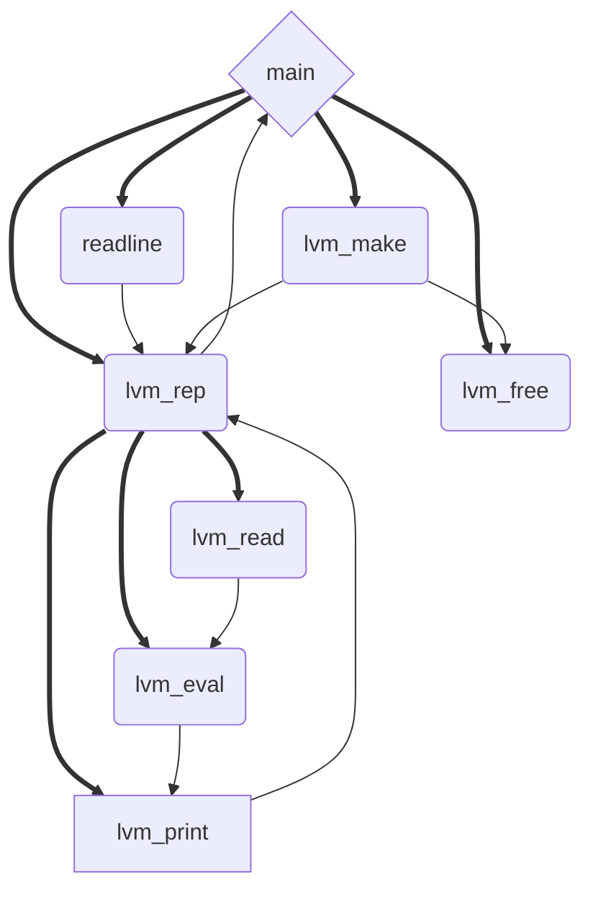

## Version 0x00 REPL
[***Main Page***](./README.md)
[***\[edit\]***](https://github.com/Aegwenia/aegwenia.github.io/edit/main/mal_00.md)

- The first version of `MAL` project using C89 standard. Responsive REPL environment.

`gcc --std=c89 -Wpedantic -pedantic -Wall -Wextra -o ./mal_00 ./mal_00.c`

[***./src/mal_00.c***](./src/mal_00.c)
```C
#include <ctype.h>
#include <stdio.h>
#include <stddef.h>
#include <stdlib.h>
#include <string.h>

struct lvm_s;
typedef struct lvm_s lvm_t, *lvm_p, **lvm_pp;

struct lvm_s {
  struct {
    char *str;
    size_t pos;
    size_t line;
    size_t column;
  } reader;
};

char *strdup(char *str);
char *strndup(char *str, size_t n);
char *readline(lvm_p this, char *prompt);
lvm_p lvm_make();
char *lvm_read(lvm_p this, char *str);
char *lvm_eval(lvm_p this, char *str);
char *lvm_print(lvm_p this, char *str);
char *lvm_rep(lvm_p this, char *str);

char *strdup(char *str)
{
  char *result;
  char *p = str;
  size_t n = 0;

  while (*p++)
    n++;
  result = malloc(n * sizeof(char) + 1);
  p = result;
  while (*str)
    *p++ = *str++;
  *p = 0x00;
  return result;
}

char *strndup(char *str, size_t n)
{
  char *result;
  char *p;
  result = malloc(n * sizeof(char) + 1);
  p = result;
  while (*str)
    *p++ = *str++;
  *p = 0x00;
  return result;
}

char *readline(lvm_p this, char *prompt)
{
  char buffer[2048], *tmp;
  (void)this;
  printf("%s", prompt);
  fgets(buffer, sizeof(buffer), stdin);
  if (feof(stdin)) {
    return NULL;
  }
  buffer[strcspn(buffer, "\r\n")] = 0x00;
  tmp = (char *)strndup(buffer, strlen(buffer));
  return tmp;
}

lvm_p lvm_make()
{
  lvm_p lvm = (lvm_p)calloc(1, sizeof(lvm_t));
  lvm->reader.str = NULL;
  lvm->reader.pos = 0;
  lvm->reader.line = 1;
  lvm->reader.column = 0;
  return lvm;
}

void lvm_free(lvm_pp this)
{
  free((void *)(*this));
  (*this) = NULL;
  return;
}

char *lvm_read(lvm_p this, char *str)
{
  this->reader.str = str;
  this->reader.pos = 0;
  return str;
}

char *lvm_eval(lvm_p this, char *str)
{
  (void)this;
  return str;
}

char *lvm_print(lvm_p this, char *str)
{
  char *output = strdup(str);
  (void)this;
  return output;
}

char *lvm_rep(lvm_p this, char *str)
{
  return lvm_print(this, lvm_eval(this, lvm_read(this, str)));
}

int main(int argc, char *argv[])
{
  lvm_p lvm = lvm_make();
  (void)argc;
  (void)argv;
  puts("Make-a-lisp version 0.0.0\n");
  puts("Press Ctrl+D to exit\n");
  while (1) {
    char *input = readline(lvm, "mal> ");
    char *output = NULL;
    if (!input) {
      putchar('\n');
      break;
    }
    output = lvm_rep(lvm, input);
    if (0x00 != output[0x00]) {
      printf("%s\n", output);
    }
    free((void *)output);
    free((void *)input);
  }
  lvm_free(&lvm);
  return 0;
}

```


